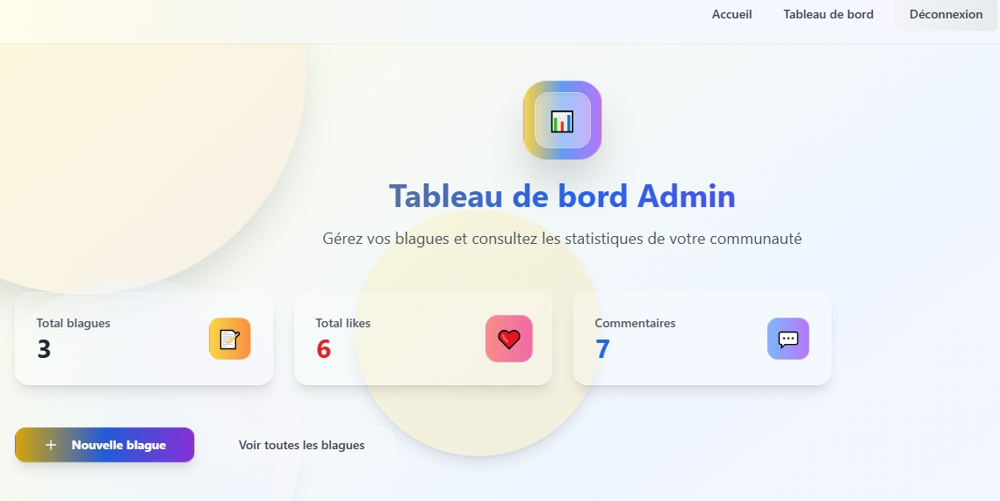
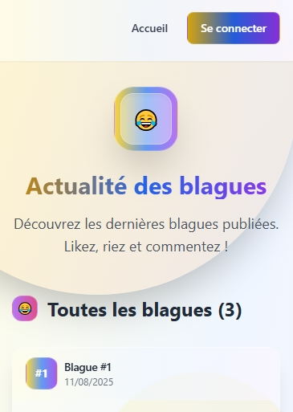

# BlagueBook

**Version** : 1.0.0
**Description** : **BlagueBook** est une application web interactive inspirée de Facebook, dédiée à la publication, au partage et à la réaction autour de blagues.
Elle permet à un administrateur unique de gérer tout le contenu et aux utilisateurs de liker, commenter et interagir.
L’interface est moderne, responsive et optimisée pour mobile et desktop.

---

## 🛠️ Stack technique

<p align="left">
  
  
  
  
  
  
  
</p>

---

## 🎯 Aperçu du projet


*Interface d’accueil de BlagueBook avec un design clair et moderne.*


*Dashboard administrateur pour gérer les blagues, commentaires et statistiques.*


*BlagueBook en version mobile (responsive).*

---

## 🚀 Fonctionnalités principales

* **Gestion unique d’administration** : un seul administrateur contrôle toutes les publications et paramètres.
* **Réactions et commentaires** : les utilisateurs peuvent aimer et commenter les publications.
* **Tableau de bord admin** : statistiques et gestion centralisée.
* **Interface responsive** : adaptée aux écrans mobiles, tablettes et ordinateurs.
* **UI moderne** : composants réutilisables avec **Tailwind CSS** et **ShadCN UI**.
* **Favicon personnalisé** : remplacement du cœur Lovable par ton icône.

---

## 📂 Structure du projet

```
BlagueBook/
├── public/              # Ressources statiques (favicon, robots.txt, images)
├── src/                 # Code source React + TypeScript
│   ├── components/      # Composants UI (ShadCN, éléments personnalisés)
│   ├── App.tsx          # Composant principal
│   ├── main.tsx         # Point d’entrée React
│   └── styles/          # Fichiers CSS (Tailwind inclus)
├── index.html           # Fichier HTML principal
├── package.json         # Dépendances et scripts
├── tailwind.config.ts   # Configuration Tailwind
└── vite.config.ts       # Configuration Vite
```

---

## ⚙️ Scripts disponibles

```bash
# Lancer le serveur de développement
npm run dev

# Build pour production
npm run build

# Aperçu de la version buildée
npm run preview

# Linter le code
npm run lint
```

---

## 🚀 Installation et lancement

```bash
# 1. Cloner le dépôt
git clone https://github.com/REBCDR07/BlagueBook.git

# 2. Accéder au dossier
cd BlagueBook

# 3. Installer les dépendances
npm install

# 4. Lancer le serveur de développement
npm run dev
```

---

## 📌 Notes


* **Optimisation responsive** : testée sur mobile et desktop.
* **Structure extensible** : facile à améliorer ou à connecter à un backend.

---

© 2025 **BlagueBook** – Développé par *\[N. E. RONALD BILL HOUNNOU]*

